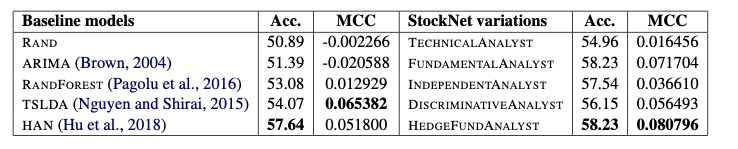

# Testing regression models on the StockNet dataset

## Dataset

The dataset for used for testing these models is from:
Yumo Xu and Shay B. Cohen. 2018. [Stock Movement Prediction from Tweets and Historical Prices](http://aclweb.org/anthology/P18-1183). In Proceedings of the 56st Annual Meeting of the Association for Computational Linguistics. Melbourne, Australia, volume 1.

## Approach

I wanted to see how well a set of simple regression models would perform at the task describe in Xu and Cohen (2018) after some feature engineering in comparison to the models in the paper (see Figure below).

### Feature engineering price points

To feature engineer price points, I took the open, close, low, and high, and movement percentage scores and applied exponential filters of different time constants: 2.5, 3.75, 5, 7.5, 10, and 20. This way a simple regression model would have access to all previous time points to varying precision.

To feature engineer the twitter data, I first extracted sentiment scores using the sentiment analysis model from Barbieri *et al*, 2022, [XLM-T: Multilingual Language Models in Twitter for Sentiment Analysis and Beyond](https://arxiv.org/abs/2104.12250). I averaged the sentiment scores for each date and stock to obtain new features that estimates the probability that sentiments are positive, negative, or neutral.

The final set of engineered features were reduced using PCA. Various sizes for dimensionality reduction were tested.

### Training the models

The models were split into a training and test set as in the paper. Unlike in the paper, the models were trained on a regression task to estimate the magnitude of the next day price movement rather than perform a simple up or down classificartion. To compare the models, the predictions were taken and thresholded to produce up and down signals. These binary signals were used to calculate respective Matthews correlation coefficients (MCC) and accuracy scores as in the paper. The best model was chosen according to its MCC score in a time series split validation process.

### Models

The trained models include various vanilla multi-layer perceptron models, regularized linear regression models, and a different types of AdaBoost regressors. These models are all well established and easily implementable.

## Best model

The best model had a test accuracy **0.53** and a MCC score of **0.085**. In this model, all features were reduced to 50 dimensions using PCA and the final regression model used the boosting algorithm with a total of 250 ridge regressors, a low learning rate (0.005), and a square loss.

Even though this model does not include a lot of the complicated architecture that exists in the paper, it performs similarly well in terms of its MCC score as the best model in the paper (HedgeFundAnalyst). However, its accuracy score is suprisingly worse.